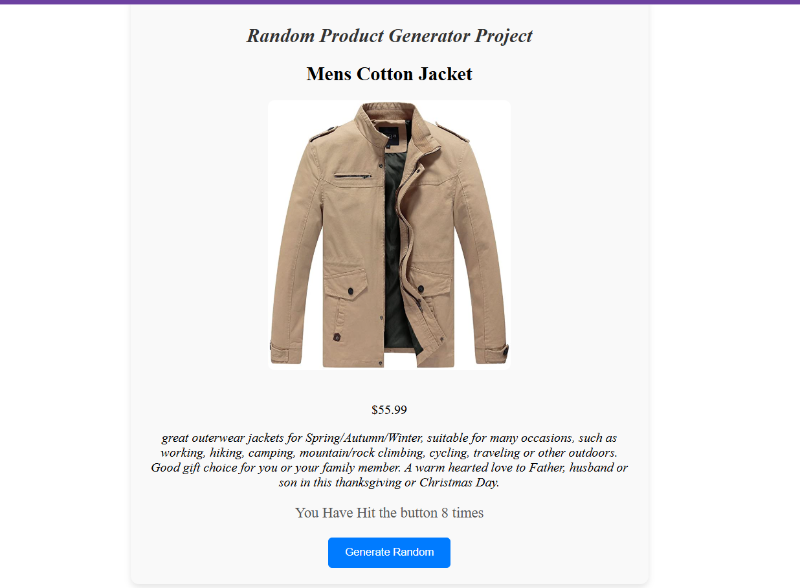

# Random Product Generator fetching store API
A simple React app that fetches and displays random products from an API and uses React Hook useState().

### Setup
##### Clone the repository:

##### cd random-product-generator

##### Install dependencies:
npm install
##### Start the app:
npm start
Open in your browser at http://localhost:3000.

### Features
Fetches random product data.
Displays product details (name, price, etc.).
### API
Uses the Fake Store API.

